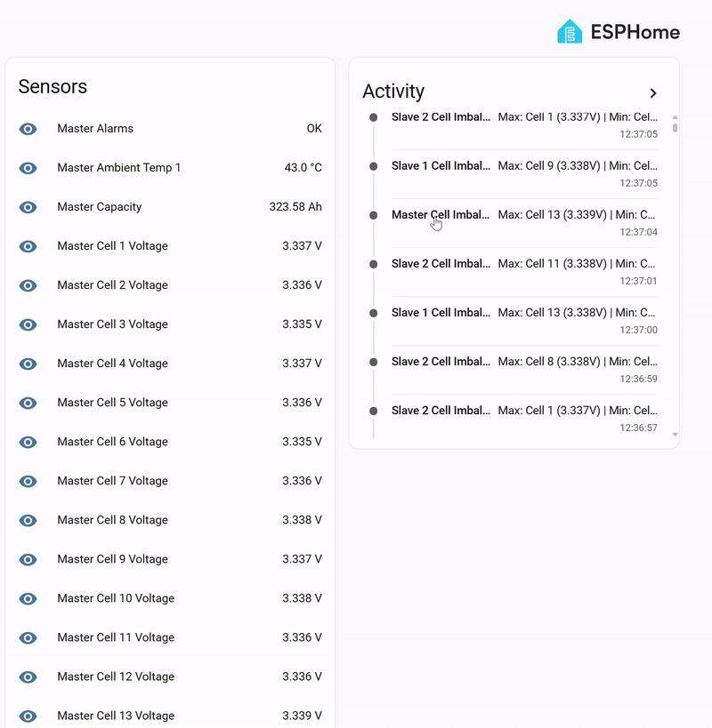
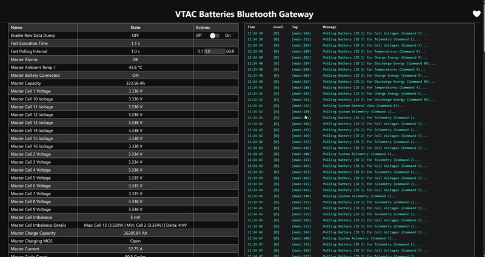

# ESPHome VTAC / PACE BMS Bluetooth Integration

A fully custom, reverse-engineered ESPHome integration for monitoring VTAC and PACE LiFePO4 Battery Management Systems (BMS) over Bluetooth Low Energy (BLE).

This project allows you to seamlessly integrate your VTAC battery banks directly into Home Assistant without relying on proprietary, cloud-dependent apps. It provides unparalleled visibility into the internal health of your battery packs.

## ✨ Key Features

- **Full Telemetry Decoding:** Accurately reads Pack Voltage, Total Current, State of Charge (SOC), Total Design Capacity, and Remaining Capacity.
- **Deep Diagnostics:** Real-time visibility into all individual Cell Voltages (up to 16 cells) and Temperature Probes (Terminal, Electrode, Ambient, MOS).
- **Parallel Pack Support:** Native support for Master/Slave parallel configurations (currently set up for 1 Master and 2 Slaves, easily expandable).
- **Virtual Smart Sensors:** Calculates and publishes derived metrics that the native app doesn't provide:
  - **Instantaneous Power (W)**
  - **Estimated Cycle Count:** Calculated directly from total lifetime discharge energy.
  - **Time to Empty / Time to Full (h):** Live estimates based on current loads.
  - **Cell Imbalance Tracking:** Calculates the millivolt delta between the highest and lowest cells, and actively identifies drifting cells (e.g. `"Max: Cell 14 (3.305V) | Min: Cell 2 (3.280V) | Delta: 25mV"`).
- **Advanced Alarm Monitoring:** Decodes 32-bit bitmasks for Primary and Secondary alarms (Over-voltage, Short Circuit, Thermal faults, etc.).
- **Safe Background Logging:** Silently captures autonomous/unsolicited broadcast messages from the BMS for debugging without crashing the battery's Bluetooth module.

## 🔋 Supported Hardware

Currently, this integration has been specifically tested on and **only supports Low Voltage (LV)** VTAC battery packs. 

**Tested & Verified Models:**
- VTAC VT-16076B
- VTAC VT-16076W

*(Note: High Voltage models may use different commands or offsets and are not officially supported yet).*

## 🎥 Demos

### ESPHome Home Assistant Integration


### Direct Webserver Diagnostics


## 🛠️ How It Works

The integration utilizes the **Nordic UART Service (NUS)** over BLE (`6E400001-B5A3-F393-E0A9-E50E24DCCA9E`). It operates via a highly optimized C++ Lambda parser inside ESPHome that implements the standard Modbus-style framing (`0xCD 0xCD` header) utilized by PACE BMS systems.

Instead of flooding the BMS with commands—which has been shown to cause the BMS Bluetooth module to hard-lock—the ESP32 utilizes a carefully timed fast/slow polling loop:
- **Fast Loop:** Polls the Master battery for System Aggregate data (Command `0x01`), then rapidly cycles through each connected battery for basic telemetry (`0x02`) and Cell Voltages (`0x03`).
- **Slow Loop:** Polls deeper diagnostics like Cell Temperatures (`0x04`) on a delayed timer.

*(Check out `VTAC_Protocol_Analysis.md` and `PACE_BMS_Modbus_Protocol.md` for our full reverse-engineering notes and exact byte offsets).*

## 🚀 Getting Started

1. **Prerequisites:** 
   - An ESP32 development board (ESP8266 does not support BLE).
   - Home Assistant with the ESPHome Add-on installed.
2. **Find Your Master Battery MAC Address:**
   - Because ESPHome connects directly to the battery, you must provide its exact Bluetooth MAC Address. Auto-discovery by name is not reliable for this protocol.
   - *How to find it:* Download a free BLE scanner app on your phone like **nRF Connect** (Android/iOS) or **LightBlue**. Stand near your batteries, scan for devices, and look for a device named something similar to `VTAC...` or `PACE...`. Note the MAC address (e.g., `1A:2B:3C:4D:5E:6F`). You only need the MAC of the **Master** battery!
3. **Configure ESPHome Secrets:**
   - In your Home Assistant ESPHome dashboard, click on **Secrets** in the top right corner.
   - Add the following required secrets. (Adjust the names if you change the device name in the yaml):
   ```yaml
   wifi_ssid: "YourWiFiName"
   wifi_password: "YourWiFiPassword"
   emgy_AP: "VTAC_Fallback_Hotspot"
   emgy_AP_Password: "FallbackPassword123"
   ota_password: "YourOTAPassword"
   vtac_batteries_bth_gateway__encryption_key: "YourAutoGeneratedAPIKey="
   vtac_batteries_bth_gateway__MasterBatteryMAC: "1A:2B:3C:4D:5E:6F"
   ```
4. **Installation:**
   - Copy the contents of `vtac_ble.yaml` into your new ESPHome node.
   - If you have fewer or more than 3 paralleled batteries, adjust the `slave_count` variable in the UI later.
   - Compile and upload the firmware to your ESP32.
   - Once connected, the sensors will automatically begin populating!

## ⚠️ Known Issues & Quirks
- **Bluetooth Lockups:** If you attempt to send unsolicited, malformed, or unmapped Hex commands to the battery (e.g., historical data requests), the PACE BMS Bluetooth module may permanently freeze. This requires physically power-cycling the battery breaker to restore Bluetooth capability.
- **Connection Drops:** The ESP32 is actively juggling WiFi and BLE simultaneously. Occasional dropped packets are normal and handled gracefully by the parser.

## ❤️ Support This Project
If you found this custom integration helpful and it saved you time, consider buying me a coffee or supporting the continued reverse-engineering of these BMS protocols!

[](https://paypal.me/jagdeepsinghbadesha)

## 📄 License
This project is open-source and licensed under the MIT License. See the `LICENSE` file for details.
